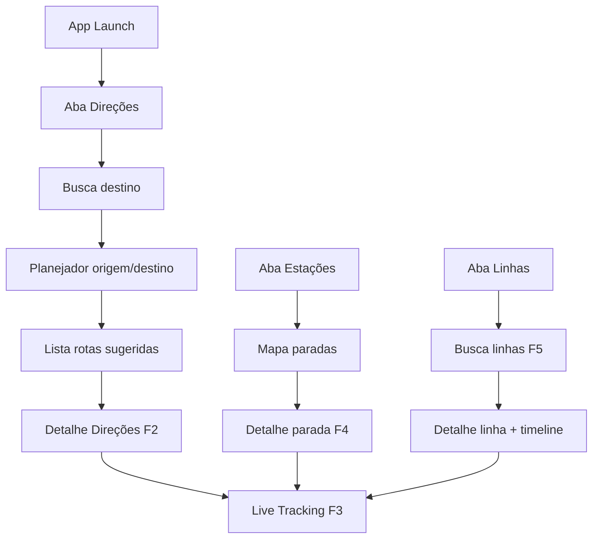

# 007 — Refatoração UX estilo Moovit (SPTrans / São Paulo)

**Data:** 2026-05-21  
**Versão:** 1.0  
**Referência UX:** [Moovit — rastreamento em tempo real (TechTudo)](https://www.techtudo.com.br/dicas-e-tutoriais/2022/12/moovit-como-usar-rastreamento-e-descobrir-onde-seu-onibus-esta-agora.ghtml)  
**Status:** 📋 Planejamento aprovado para execução (Fase 6)

---

## R — Requirements (Requisitos)

### Objetivo

Substituir o layout atual (Uber: mapa full-screen + bottom sheet único) por **navegação em 3 abas** estilo Moovit, mantendo arquitetura SPM e compatibilidade **iOS 16 / Xcode 14.2**.

### Funcionalidades (5 fluxos do Moovit → WIMB)

| ID | Nome Moovit | Fluxo WIMB | Imagens ref. |
|----|-------------|------------|--------------|
| **F1** | Direções | Home → busca destino → Planejador (origem/destino) → lista de rotas sugeridas | 1, 2 |
| **F2** | Direções → detalhe | Toque na rota → tela “Direções” com mapa + passo a passo + botão **Localização em tempo real** | 3 |
| **F3** | Localização em tempo real (trajeto) | Mapa com rota destacada, setas de sentido, múltiplos ônibus, card inferior (ETA + paradas de distância) | 4, 5, 6 |
| **F4** | Estações | Aba Estações → mapa de paradas próximas → detalhe da parada → linhas chegando → **Localização em tempo real** | 7, 8, 9, 10 |
| **F5** | Linhas | Aba Linhas → busca/filtro ônibus → detalhe da linha (mapa + timeline paradas) → **Localização em tempo real** | 11, 12 |

### Critérios de aceite globais

| # | Critério |
|---|----------|
| AC1 | App abre na aba **Direções** |
| AC2 | Tab bar fixa: **Direções · Estações · Linhas** |
| AC3 | Textos humanizados pt-BR + en (`WIMBL10n`) |
| AC4 | Rota no mapa em **amarelo** no modo live (Moovit); azul no modo planejamento |
| AC5 | Setas de sentido ao longo da polilinha |
| AC6 | Card inferior: linha, destino, **X min** (verde), **N paradas de distância**, contador de refresh |
| AC7 | Polling automático de veículos (TransportEngine existente) |
| AC8 | Screenshots documentados em `docs/screenshots/moovit/` após cada subfase |

### Limitações SPTrans (Olho Vivo)

A API **não oferece** planejamento A→B multimodal como o Moovit global. Estratégia:

| Recurso Moovit | Solução WIMB |
|----------------|--------------|
| Geocoding endereço | **MapKit `MKLocalSearch`** (grátis, iOS nativo) |
| Rotas sugeridas A→B | **Heurística MVP**: linhas cujas paradas ficam a ≤800 m da origem e destino; score por tempo estimado (`SmartArrivalPredictor`) |
| Tarifa R$ | Constante Bilhete Único SP (~R$ 4,40) — configurável |
| Paradas no mapa | Novo endpoint **`/Parada/Buscar`** + paradas de `/Previsao/Linha` |
| Sentido ida/volta | Campo `sentido`/`terminal` de `TransportLine` + toggle “Trocar sentido” |

### Funcionalidades prioritárias para usuários de SP (além do Moovit)

1. **Previsão por parada** (`/Previsao/Parada`) — essencial no ponto  
2. **Favoritos Casa / Trabalho / Parada** — uso diário classe B/C/D  
3. **Sentido da linha** (Terminal A → Terminal B) — evita pegar ônibus invertido  
4. **Ônibus adaptado** (flag `accessible` já existe)  
5. **Metrô perto** (Fase 4 — manter na aba Direções)  
6. **Clima + atraso na chuva** (Fase 4 — chip no mapa)  

### Evoluções futuras (pós-F6)

- Integração CPTM / metrô com horários reais (API ViaMobilidade ou GTFS)  
- Notificação “ônibus chegando” (geofence na parada)  
- Widget iOS 16 “próximo ônibus”  
- Histórico “Visualizado recentemente” (CoreData/SwiftData)  
- Crowdsourcing atrasos (fora do escopo SPTrans)

---

## E — Examples (Referências visuais)

### Design tokens Moovit → WIMB

| Elemento | Moovit | Token WIMB |
|----------|--------|------------|
| Botão busca | Laranja | `WIMBShellColors.orange` `#FF6900` |
| Tab ativa | Azul | `WIMBShellColors.tabActive` `#007AFF` |
| Rota live | Amarelo | `WIMBColors.routeLive` `#FFD700` |
| ETA ao vivo | Verde | `WIMBColors.etaLive` `#34C759` |
| Header planejador | Cinza escuro | `WIMBColors.plannerHeader` `#2C2C2E` |
| Card rota | Branco + sombra | `WIMBListRow` + `shadow(radius: 4)` |

### Wireflow de navegação



### Mapeamento imagem → tela

| Img | Tela SwiftUI | Package |
|-----|--------------|---------|
| 1 | `DirectionsHomeView` | AppFeature |
| 2 | `TripPlannerView` + `SuggestedRoutesView` | TripPlannerFeature |
| 3 | `RouteDirectionsView` | TripPlannerFeature |
| 4–6 | `LiveLineTrackingView` | MapFeature |
| 7 | `StationsMapView` | StationsFeature |
| 8 | `StopArrivalsView` | StationsFeature |
| 9–10 | `LiveStopTrackingView` | MapFeature |
| 11 | `LinesHomeView` | LinesFeature |
| 12 | `LineRouteView` | LinesFeature |

---

## A — Architecture (Arquitetura)

### ADR-005: Shell Moovit com 3 abas

- **Decisão:** `MainShellView` como root; cada aba é um `NavigationStack` (iOS 16) independente  
- **Estado:** `AppNavigationState` (@MainActor ObservableObject) + `TrackingState` existente  
- **Consequência:** Substitui `TripListView` + `TransportHomeView` como entry point  

### ADR-006: Novo package `AppShell` (umbrella)

Produtos SPM adicionados em `Packages/Package.swift`:

| Package | Responsabilidade |
|---------|------------------|
| **AppShell** | Tab bar, `AppNavigationState`, favoritos, recentes |
| **TripPlannerFeature** | F1–F2: geocoding, sugestões de rota |
| **StationsFeature** | F4: mapa paradas, detalhe parada |
| **LinesFeature** | F5: lista/busca linhas, timeline |
| **MapFeature** (estender) | F3/F9/F10: live tracking, polilinha amarela, setas |
| **DesignSystem** (estender) | Tokens Moovit, tab bar, cards de rota |

### Diagrama de dependências

```
WhereIsMyBusApp
 └── AppShell
      ├── TripPlannerFeature → TransportEngine, NetworkClient, WIMBCore
      ├── StationsFeature    → MapFeature, TransportEngine
      ├── LinesFeature       → TransportEngine, DesignSystem
      └── MapFeature         → TransportEngine, DesignSystem
```

### Estado compartilhado

```swift
@MainActor
final class AppNavigationState: ObservableObject {
    @Published var selectedTab: AppTab = .directions
    @Published var navigationPath = NavigationPath()
    @Published var favorites: [FavoritePlace] = []
    @Published var recentTrips: [RecentTrip] = []
}

enum LiveTrackingContext {
    case fromTripRoute(TripSuggestion)
    case fromStop(stop: Stop, line: TransportLine)
    case fromLine(line: TransportLine)
}
```

---

## S — Structure (Estrutura de arquivos)

### App (`Shared/`)

```
Shared/
├── App/
│   ├── WIMBAppEnvironment.swift      # + factories novos states
│   └── MainShellView.swift         # NEW root
├── Features/                         # depreciar TripList/* gradualmente
└── Localization/                     # + strings Moovit
```

### Packages (novos / alterados)

```
Packages/
├── AppShell/Sources/AppShell/
│   ├── WIMBMainTabBar.swift
│   ├── AppNavigationState.swift
│   └── AppTab.swift
├── TripPlannerFeature/
│   ├── Views/DirectionsHomeView.swift
│   ├── Views/TripPlannerView.swift
│   ├── Views/SuggestedRoutesView.swift
│   ├── Views/RouteDirectionsView.swift
│   ├── Services/PlaceSearchService.swift      # MKLocalSearch
│   └── Services/RouteSuggestionEngine.swift   # heurística SP
├── StationsFeature/
│   ├── Views/StationsMapView.swift
│   ├── Views/StopArrivalsView.swift
│   └── Services/NearbyStopsService.swift
├── LinesFeature/
│   ├── Views/LinesHomeView.swift
│   ├── Views/LineRouteView.swift
│   └── Views/LineTimelineView.swift
├── MapFeature/ (estender)
│   ├── Views/LiveLineTrackingView.swift
│   ├── Views/LiveStopTrackingView.swift
│   ├── Views/RoutePolylineWithArrows.swift
│   └── Models/LiveTrackingCardModel.swift
├── NetworkClient/ (estender)
│   └── SPTrans/SPTransEndpoint.swift  # + searchStops
└── DesignSystem/ (estender)
    ├── Tokens/WIMBShellColors.swift
    ├── Components/WIMBMainTabBar.swift
    ├── Components/WIMBRouteSuggestionCard.swift
    └── Components/WIMBLiveTrackingCard.swift
```

---

## O — Operations (Plano de execução)

### Fase 6 — subdivisões

| Subfase | Entrega | Func. | Estimativa |
|---------|---------|-------|------------|
| **6.1** | Design tokens Moovit + Tab bar + shell | — | 2–3 dias |
| **6.2** | F5 Linhas (reaproveita busca atual) | F5 | 2 dias |
| **6.3** | F3 Live tracking UI (amarelo, setas, card) | F3 | 3 dias |
| **6.4** | F4 Estações + `/Parada/Buscar` | F4 | 3–4 dias |
| **6.5** | F1–F2 Planejador + rotas sugeridas | F1, F2 | 4–5 dias |
| **6.6** | Favoritos, recentes, polish, screenshots | — | 2 dias |

### 6.1 — Shell + Design (primeiro PR)

- [x] `WIMBShellColors`, `WIMBMainTabBar`
- [x] `MainShellView` substitui `TripListView` em `WhereIsMyBusApp`
- [x] Placeholders nas 3 abas  
- [x] Localização tab labels  
- [ ] Screenshot: `docs/screenshots/moovit/01-tab-shell.png`  
- [ ] Atualizar `INTEGRATION-GUIDE.md` § Fase 6  

### 6.2 — Aba Linhas (F5)

- [x] `LinesHomeView`: search + filtros (Todos/Ônibus) + recentes  
- [x] `LineRouteView`: mapa + header escuro + timeline paradas (img 12)  
- [x] Botão **Localização em tempo real** → `LiveLineTrackingView`  
- [ ] Screenshot: `11-lines-home.png`, `12-line-route.png`  

### 6.3 — Live Tracking (F3) — core visual

- [x] Polilinha **amarela** + markers direcionais  
- [x] Múltiplos veículos no mapa (já existe animação)  
- [x] `WIMBLiveTrackingCard`: linha, destino, ETA verde, paradas distância, timer  
- [x] Header flutuante: nome parada/linha + botões X e rota  
- [ ] Screenshot: `04-live-tracking.png`, `05-multi-bus.png`, `06-countdown.png`  

### 6.4 — Aba Estações (F4)

- [x] `NetworkClient`: `searchStops(query:)` + `fetchNearbyStops(coordinate:)`  
- [x] `StationsMapView`: pins parada, botão “Ver estações ao redor”  
- [x] `StopArrivalsView`: lista linhas + previsões (img 8)  
- [x] Fluxo → live tracking por linha na parada  
- [ ] Screenshot: `07-stations-map.png`, `08-stop-arrivals.png`, `09-10-live-stop.png`  

### 6.5 — Direções + Planejador (F1–F2)

- [x] `DirectionsHomeView`: hero + busca laranja + recentes + favoritos (img 1)  
- [x] `TripPlannerView`: origem/destino, swap, “Sair agora” (img 2)  
- [x] `RouteSuggestionEngine`: scoring linhas SPTrans  
- [x] `RouteDirectionsView`: mapa preview + passos + botão live (img 3)  
- [ ] Screenshot: `01-directions-home.png`, `02-trip-planner.png`, `03-route-detail.png`  

### 6.6 — Polish

- [x] Migrar/remover `TripHomePanel`, `TransportHomeView` legado  
- [x] README + `.spdd/` atualizados  
- [x] Testes: `RouteSuggestionEngineTests`, `NearbyStopsServiceTests`  
- [x] Build Xcode 14.2 + simulador iOS 16.2  

---

## N — Notes (Riscos e mitigação)

| Risco | Mitigação |
|-------|-----------|
| Planejador A→B impreciso sem API de rotas | MVP heurístico + copy honesto: “Sugestões com base nas linhas SPTrans” |
| `/Parada/Buscar` instável | Cache + fallback paradas de linhas rastreadas |
| Polilinha com setas no iOS 16 | Segmentos MKPolyline + annotation views para setas |
| Escopo grande | 6 PRs incrementais (6.1→6.6), cada um mergeável |

---

## S — Summary

A Fase 6 reposiciona o WIMB de “app estilo Uber” para **app estilo Moovit**, focado no que usuários de transporte público em São Paulo mais usam: **saber qual linha pegar, ver o ônibus chegando no mapa e consultar paradas próximas**. A base técnica (SPM, TransportEngine, MapFeature, SPTrans) permanece; a mudança principal é **navegação, design system e novos fluxos de UI**.

**Próximo passo imediato:** executar subfase **6.1** (shell + tab bar + tokens).
