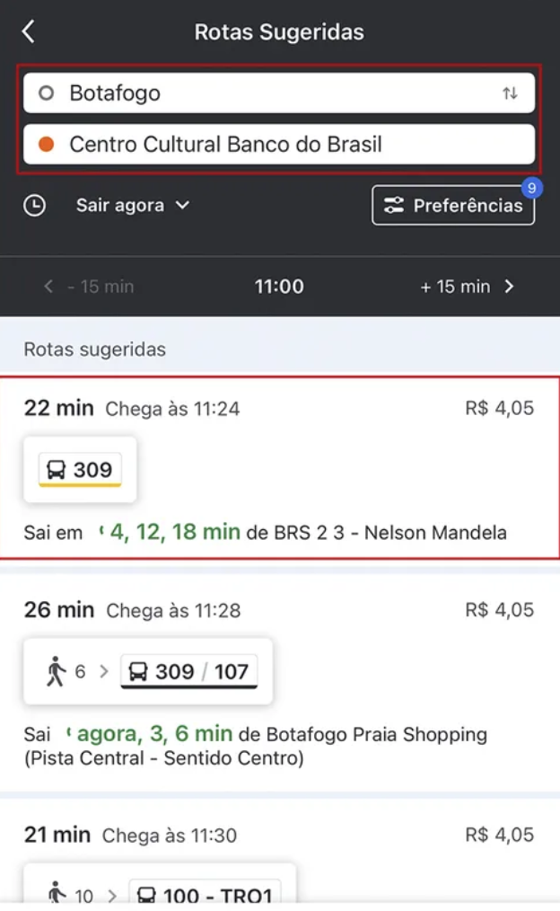
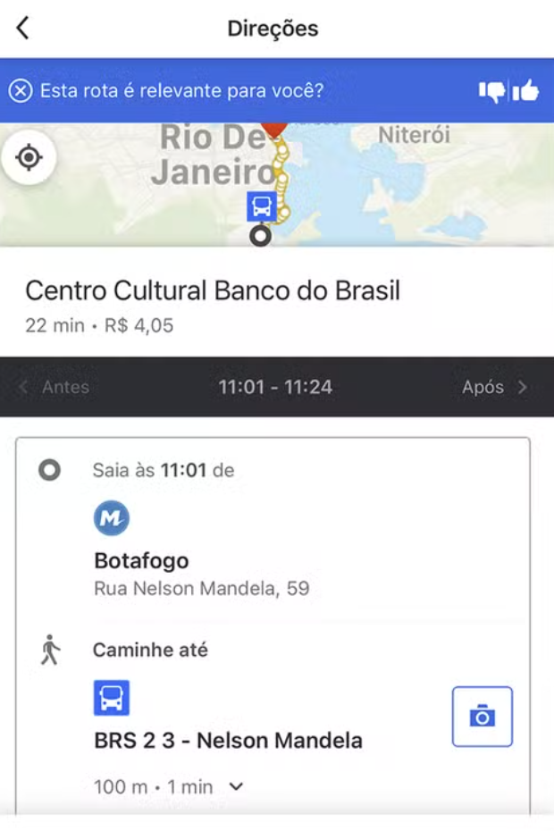
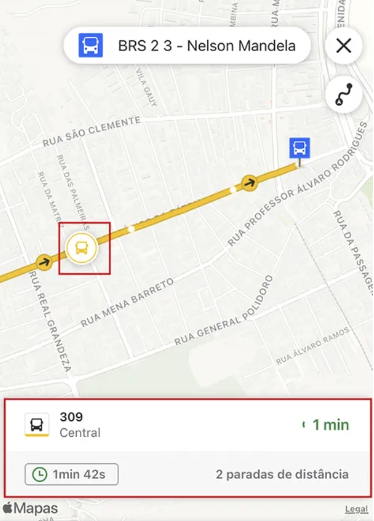

# Where Is My Bus (WIMB)

App iOS para acompanhar ônibus em tempo real em São Paulo, usando a API Olho Vivo da SPTrans.

**Público-alvo:** quem depende do transporte público todos os dias — linguagem simples, informação direta, sem jargão técnico.

## Roadmap — Fase 6 (UX 2.0) ✅

O app usa **3 abas** focadas no uso real de transporte público em SP:

| Aba | Função |
|-----|--------|
| **Como ir** | Busca destino → planejador → caminhos sugeridos → ônibus no mapa |
| **Paradas** | Paradas no mapa → linhas que passam → chegadas ao vivo |
| **Linhas** | Busca por número → trajeto da linha → acompanhamento ao vivo |

Documentação:

- [Plano de execução](.spdd/MOOVIT-EXECUTION-PLAN.md)
- [Canvas REASONS 007](.spdd/canvas/007-Moovit-UX-Refactoring.md)
- [Guia de integração](.spdd/INTEGRATION-GUIDE.md)
- [Referências visuais](docs/screenshots/moovit/README.md)

### Referências visuais (Fase 6)

| Como ir | Planejador | Ao vivo |
|----------|------------|---------|
|  |  |  |

## Próxima fase — Inteligência em tempo real (proposta)

Objetivo: dar ao passageiro **informação privilegiada** — o que o painel da parada não mostra — especialmente na madrugada, quando poucos apps e canais oficiais estão atualizados.

### O que o usuário precisa saber (4h–6h da manhã)

| Situação | O que mostrar |
|----------|----------------|
| Linha não aparece no mapa | "Pode ser que ainda não saiu do terminal" vs "Há relato de problema nesta linha" |
| Metrô com atraso | Qual estação, sentido, tempo extra estimado, alternativa de ônibus |
| Chuva forte | Aviso de atraso + sugestão de sair mais cedo |
| Acidente / interdição | Trecho afetado, linhas desviadas, metrô como plano B |
| Greve parcial | Quais operadoras e linhas estão rodando |

### Fontes de dados (APIs, feeds e coleta)

| Fonte | O que traz | Como usar |
|-------|------------|-----------|
| **SPTrans Olho Vivo** (já integrado) | Posição de ônibus, previsões, paradas | Base do app |
| **Metrô / ViaMobilidade / CPTM** | Status de linhas, estações fechadas, atrasos | API oficial ou status page (ex.: `status.metro.sp.gov.br`) |
| **EMTU** | Ônibus intermunicipais na região metropolitana | API / GTFS quando disponível |
| **CET / Prefeitura SP** | Interdições, obras, desvios | RSS, dados abertos, Twitter/X oficial |
| **Clima (OpenWeather etc.)** | Chuva, temporal | Já parcialmente usado — expandir para alerta proativo |
| **Notícias e redes** | Acidentes, protestos, alagamentos | RSS (G1, CET, SPTrans) + monitoramento de hashtags |
| **GTFS / GTFS-RT** | Horários e atrasos estruturados | Quando SPTrans/EMTU publicarem feeds RT |
| **Dados abertos SP** | Obras, eventos, fechamentos | `dados.prefeitura.sp.gov.br` |

> **Scraping:** usar só quando não houver API estável, com cache agressivo, parser resiliente e fallback gracioso. Priorizar feeds RSS/JSON oficiais antes de HTML.

### Camada de IA (análise + linguagem simples)

Pipeline sugerido:

```
Fontes (API + RSS + status pages)
        ↓
  Normalização (eventos estruturados)
        ↓
  Correlacionação (linha ↔ trecho ↔ metrô ↔ clima)
        ↓
  LLM / regras → resumo em português claro
        ↓
  Push + banner no app + card na rota
```

**Exemplos de insights gerados pela IA:**

- *"A linha 8000 está 12 min atrasada. Chove na região — isso costuma atrasar mais 5–10 min."*
- *"Estação Sé com movimento lento. Se estiver com pressa, a linha 107P passa a 200 m e chega em ~18 min."*
- *"Desvio na Av. Paulista por manifestação. Seu caminho sugerido foi recalculado."*
- *"Madrugada: só 2 ônibus circulando na 8000. Próximo em ~22 min (confiança baixa)."*

**Regras de produto:**

- Sempre mostrar **de onde veio a informação** (SPTrans, Metrô, notícia, estimativa)
- Indicar **confiança** (alta / média / baixa) — especialmente de madrugada
- Nunca inventar posição de ônibus; IA resume e cruza, não substitui GPS
- Textos curtos, tom de conversa, sem siglas sem explicação

### Funcionalidades prioritárias

1. **Painel "Como está agora"** na aba Como ir — resumo do trajeto Casa→Trabalho
2. **Alertas push** configuráveis (linha favorita, chuva, metrô parado)
3. **Modo madrugada** — polling mais frequente + aviso quando dados são escassos
4. **Metrô integrado de verdade** — status por linha (azul, vermelha, etc.) + tempo até estação
5. **Histórico de confiabilidade** — "esta linha costuma atrasar 8 min neste horário"
6. **Plano B automático** — quando ônibus some ou metrô falha, sugere rota alternativa

### Arquitetura técnica (rascunho)

Novo package `TransportIntelligence` (ou serviço backend):

- `AlertIngestionService` — poll RSS/APIs a cada 1–5 min
- `OperationalEvent` — modelo unificado (tipo, trecho, linhas afetadas, validade)
- `RouteImpactAnalyzer` — cruza evento com rota ativa do usuário
- `InsightGenerator` — LLM com prompt fixo + contexto estruturado (não texto livre da web)
- Cache local + TTL por tipo de evento

Backend opcional (Cloudflare Worker / Vercel) para centralizar scraping e reduzir carga no app.

## Requisitos

| Ferramenta | Versão |
|------------|--------|
| Xcode | 14.2+ |
| Swift | 5.7+ |
| iOS | 16.0+ |

## Configuração

1. Clone o repositório e abra `WhereIsMyBus.xcodeproj`.
2. Configure o token da SPTrans em **Product → Scheme → Edit Scheme → Run → Environment Variables**:
   - `SPTRANS_TOKEN` = seu token Olho Vivo
3. Build e run no simulador ou dispositivo.

Os packages SPM ficam em `Packages/` (monorepo umbrella). Veja [Packages/README.md](Packages/README.md).

## Idiomas

O app segue o idioma do sistema (**pt-BR** e **en**). Textos pensados para clareza — sem termos técnicos desnecessários. Arquivos em `Shared/Resources/`.

Mensagens de erro amigáveis via `WIMBError.userMessage` → `Localizable.strings`.

## Arquitetura

```
WhereIsMyBusApp
 └── MainShellView (AppShell)
      ├── DirectionsTabRootView — planejador + favoritos Casa/Trabalho
      ├── StationsTabRootView — mapa de paradas + chegadas
      └── LinesTabRootView — busca de linhas + live tracking
```

| Package | Função |
|---------|--------|
| WIMBCore | Modelos (`Vehicle`, `Stop`, `TripPlace`, `RouteSuggestion`) |
| NetworkClient | HTTP + SPTransClient + WeatherClient |
| TransportEngine | Polling, `TrackingState`, `DirectionsState`, `RouteSuggestionEngine` |
| DesignSystem | Tab bar, cards, tokens visuais |
| MapFeature | `TransportMapView`, `StationsMapView`, live tracking |
| AppShell | `MainShellView`, navegação por abas |

## Funcionalidades

- **Como ir:** busca de endereço (MapKit), caminhos sugeridos, favoritos Casa/Trabalho
- **Paradas:** paradas perto de você, previsões por linha na parada
- **Linhas:** busca, trajeto, acompanhamento ao vivo com rota no mapa
- Previsões inteligentes (SPTrans + movimento + clima)
- Metrô perto de você como alternativa

## Licença

Projeto pessoal — consulte o autor para uso.
