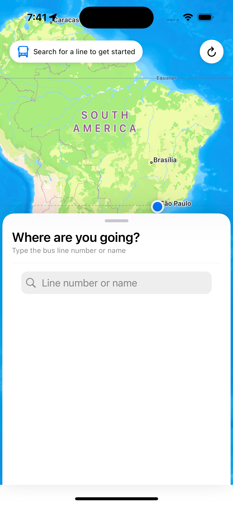
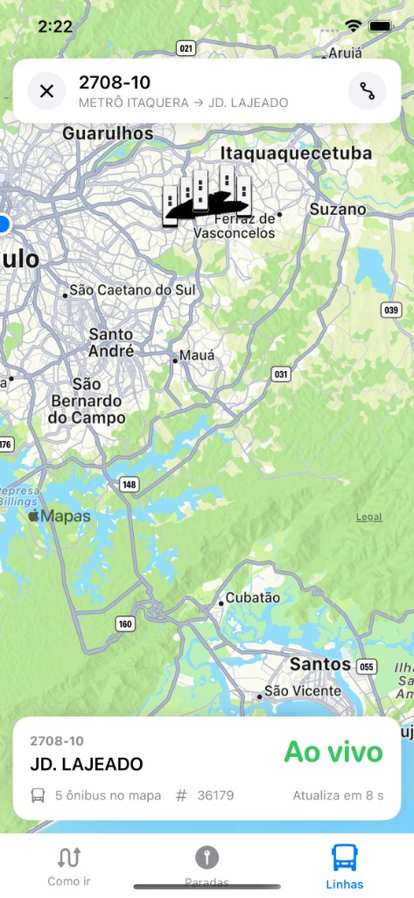

# Where Is My Bus (WIMB)

App iOS para acompanhar ônibus em tempo real em São Paulo, usando a API Olho Vivo da SPTrans.

## Propósito

Ajudar quem depende do transporte público todos os dias — especialmente classes C, D e E — a **saber onde está o ônibus agora**, quanto falta para chegar e qual caminho fazer, com linguagem simples e informação direta.

O foco não é replicar um mapa genérico: é dar **visibilidade do ônibus ao vivo**, da rota e das paradas, para quem precisa decidir na hora se espera, corre ou busca alternativa (metrô, outra linha).

## Funcionalidades

| Aba | O que faz |
|-----|-----------|
| **Como ir** | Busca endereço, favoritos Casa/Trabalho, caminhos sugeridos e metrô perto |
| **Paradas** | Paradas no mapa, linhas que passam e chegadas ao vivo na parada |
| **Linhas** | Busca por número, trajeto da linha e **live tracking** com animação no mapa |

Outras capacidades:

- Previsões inteligentes (SPTrans + movimento + clima)
- Textos humanizados em pt-BR e en
- Mensagens de erro claras, sem jargão técnico
- Live tracking com zoom no nível dos ônibus, rota local e card "Ao vivo"

## Screenshots

| Como ir | Detalhe da linha | Live tracking |
|---------|------------------|---------------|
|  |  |  |

## Arquitetura

```
WhereIsMyBusApp
 └── MainShellView (AppShell)
      ├── DirectionsTabRootView — planejador + favoritos Casa/Trabalho
      ├── StationsTabRootView — mapa de paradas + chegadas
      └── LinesTabRootView — busca de linhas + live tracking
```

| Package | Função |
|---------|--------|
| WIMBCore | Modelos (`Vehicle`, `Stop`, `TripPlace`, `RouteSuggestion`) |
| NetworkClient | HTTP + SPTransClient + WeatherClient |
| TransportEngine | Polling, `TrackingState`, `DirectionsState`, `RouteSuggestionEngine` |
| DesignSystem | Tab bar, cards, tokens visuais |
| MapFeature | `TransportMapView`, `StationsMapView`, live tracking |
| AppShell | `MainShellView`, navegação por abas |

Documentação técnica: [.spdd/INTEGRATION-GUIDE.md](.spdd/INTEGRATION-GUIDE.md)

## Requisitos

| Ferramenta | Versão |
|------------|--------|
| Xcode | 14.2+ |
| Swift | 5.7+ |
| iOS | 16.0+ |

## Configuração

1. Clone o repositório **com submodules** (necessário para o código SPM):

```bash
git clone --recurse-submodules https://github.com/douglastaquary/wimb.git
cd wimb
```

Se já clonou sem submodules:

```bash
git submodule update --init --recursive
```

2. Abra `WhereIsMyBus.xcodeproj`.
3. Configure o token da SPTrans em **Product → Scheme → Edit Scheme → Run → Environment Variables**:
   - `SPTRANS_TOKEN` = seu token Olho Vivo
4. Build e run no simulador ou dispositivo.

Os packages SPM ficam no submodule `Packages/` ([wimb-packages](https://github.com/douglastaquary/wimb-packages)). Veja [Packages/README.md](Packages/README.md).

## Idiomas

O app segue o idioma do sistema (**pt-BR** e **en**). Arquivos em `Shared/Resources/`.

## Próximos passos

### Inteligência em tempo real

Objetivo: informação privilegiada — acidentes, metrô, chuva, greves — especialmente na madrugada.

| Prioridade | Funcionalidade |
|------------|----------------|
| 1 | Painel "Como está agora" na aba Como ir (Casa → Trabalho) |
| 2 | Alertas push (linha favorita, chuva, metrô parado) |
| 3 | Modo madrugada com aviso quando dados são escassos |
| 4 | Metrô integrado — status por linha + tempo até estação |
| 5 | Histórico de confiabilidade por linha e horário |
| 6 | Plano B automático quando ônibus some ou metrô falha |

**Fontes planejadas:** SPTrans Olho Vivo (já integrado), Metrô/ViaMobilidade/CPTM, EMTU, CET, clima, RSS/notícias, GTFS-RT, dados abertos SP.

**Camada de IA:** ingestão → normalização → correlação (linha + trecho + clima) → resumo em português claro → push/banner no app. A IA resume e cruza dados; nunca inventa posição GPS.

### Live tracking — múltiplas rotas

- Visualizar veículos em **várias rotas ao mesmo tempo**, cada uma com **cor diferente** no mapa
- **Card por rota** na parte inferior (linha, destino, ônibus, ETA)
- Toque no card → rota respectiva fica em **evidência** (zoom + destaque); as demais ficam mais discretas
- Objetivo: acompanhar 2–3 linhas relevantes sem perder a animação clara de cada uma

## Licença

Projeto pessoal — consulte o autor para uso.
